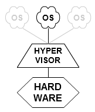
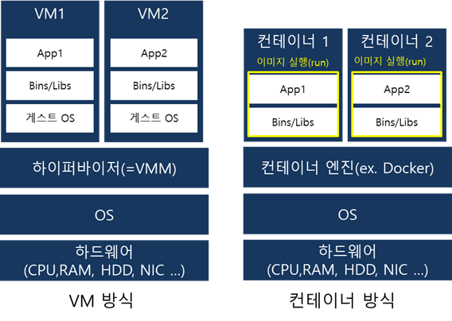
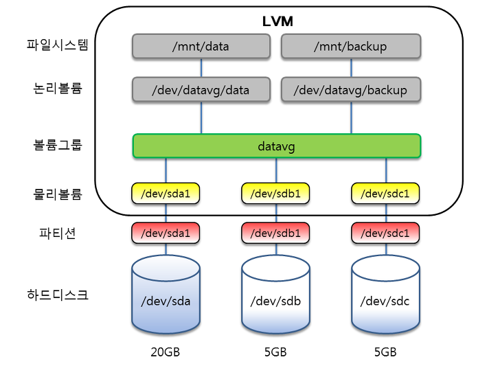
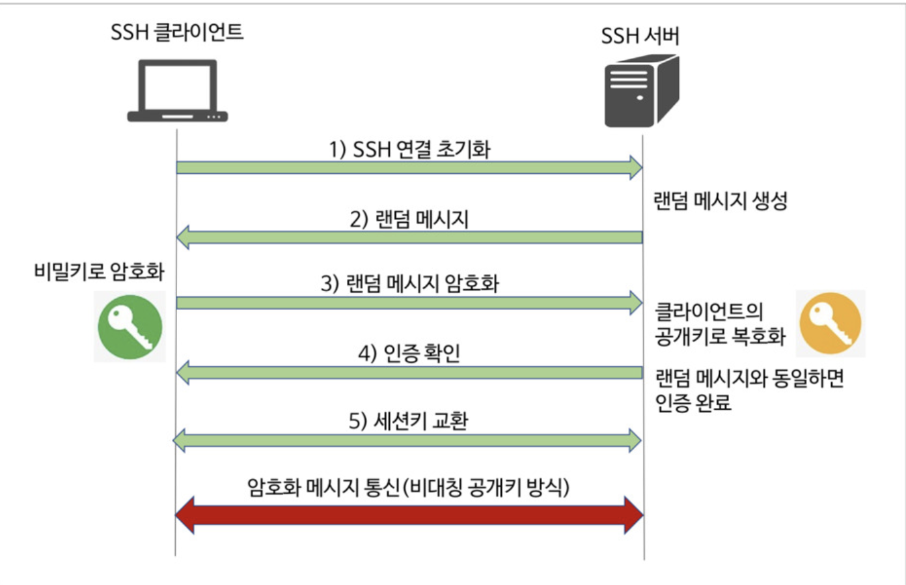
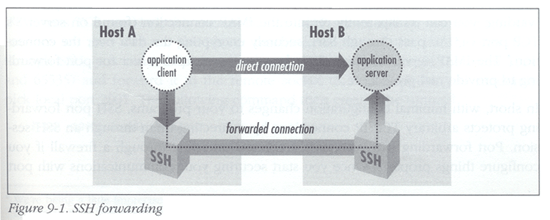

# born2beroot

## 요약

- VM기술을 활용해서 여러 요구사항들을 만족시켜라
- [평가지](https://github.com/wshloic/born2beroot_correction/blob/master/correction_born2beroot.pdf)

## 사전 요구 지식 정리

### Virtual Machine이란?

- 하나의 물리 서버를 보다 효율적으로 사용하기 위해 탄생함
- virtual machine으로 할 수 있는것
    - 맥북에 리눅스 배포판을 깐 후, 사용할 수 있음
    - 맥북에 윈도우를 깔아서 공공기관 사이트들을 사용할 수 있음
- 물리적 하드웨어 시스템에 CPU, 메모리, 네트워크 인터페이스 및 스토리지를 갖추고 가상으로 컴퓨터 시스템을 동하는 가상환경 리소스 가상화 프로그램
    - 가상환경을 구성하느 방법은 에뮬레이션, 가상화, 반가상화가 있다.
        - 에뮬레이션
            - 모든 부품의 모든 기능을  소프트웨어적으로 구현. 범용성 제일 좋음
        - 가상화
            - CPU같은 주요 부품의 기능에서 하드웨어의 기능을  지원받음. 하드웨어에 종속되서 범용성 떨어짐
        - 반가상화
            - 기반이 되는 하드웨어, 소프트웨어와 동일하지는 않지만 비슷한 가상머신에 UI를 제공
- 호스트-게스트로 구성되어있다
    - 호스트 (호스트 머신, 호스트 컴퓨터, 호스트 운영체제)
        - 하이퍼바이저가 탑재된 물리적 머신임
    - 게스트 (게스트 머신, 게스트 컴퓨터, 게스트 운영체제)
        - 하이퍼바이저로 인해 리소스를 사용하는 머신임
- 하이퍼바이저?
    - 호스트 컴퓨터에서 다수의 운영체제를 동시에 운영하기 위한 논리적 플랫폼
        - ex) vmware, virtual box
    - 호스트 시스템에서 다수의 게스트를 구동할 수 있게 해주는 소프트웨어 (호스트와 게스트를 이어준다)
    - 유형
        1. 네이티브 or 하이퍼바이저형

            `Xen, 마이크로소프트 Hyper-V, KVM`

            

            - 하이퍼바이저가 하드웨어를 직접 제어해서 효율적임
            - 여러 하드웨어 드라이버를 세팅해야해서 설치가 어려움
        2. 호스트형

            `VMware server, VMware Workstation, Virtual box`

            

            - 일반적인 소프트웨어 처럼 호스트OS위에서 실행됨
            - VM내부의 게스트 OS에 하드웨어자원을 에뮬레이트하는 방식
            - 게스트OS에 대한 제약이 없다
- 부가적인 지식
    - 컨테이너 방식의 가상화 Docker

        

        - 기존의 하이퍼바이저는 OS를 포함하고 있어 기능의 중복이 있고 상대적으로 무거웠음
        - 컨테이너 기반 가상화는 기능의 중복을 줄이고 가벼운 가상화를 위해 탄생함. 도커는 그중에 하나
    - 컨테이너 개념; 실행에 필요한 라이브러리와 바이너리, 기타 구성파일을 `이미지`단위로 빌드하고 배포함
        - 이런 이미지들을 docker hub에서 공유하기도 함. git clone 하듯이 이미지를 가져와 바로 사용할 수 있다.
        - mysql db서버를 구동시키기 위한 도커이미지도 있고, 마인크래프트의 멀티를 위한 도커이미지도 있다
    - 하이퍼바이저보다 훨씬 가벼움(MB단위)

### CentOS 와 Debian의 차이?

- CentOS
    - 레드햇이라는 회사에서 상용으로 배포한 리눅스(RHEL) 소스를 가져와 RHEL과 가깝게 기능을  반영하고 있는 리눅스 (유료화에 대한 반발)
    - 오픈소스이다보니 업데이트가 느림. 기술지원도..
    - 그래서 인력이 충분한곳은 CentOS를 선호, 안정성이 중요한 금융권은 RHEL 선호
    - 주로 Yum을 통해 소프트웨어를 업데이트할 수 있으며 up2date도 지원한다.
- debian
    - 온라인 커뮤니티에서 제작하여 배포됨.
    - 초반에는 레드햇계열에 비해 사후지원과 유틸성능이 뒤쳐졌으나 현재는 뒤쳐지지않으며 넓은 유저층을 가짐
    - 데비안의 특징은 패키지 설치 및 업그레이드의 단순함에 있다. 일단 인스톨을 한 후 패키지 매니저인 **APT 업데이트 방식**을 이용하면 소프트웨어의 설치나 업데이트에서 다른 패키지와의 의존성 확인, 보안관련 업데이트 등을 **자동으로 설정 및 설치**해준다.

[추가적인 내용..](https://velog.io/@joonpark/Debian-vs-CentOS)

### LVM (Logical Volume Manage)



- 논리 볼륨 관리자
- 물리적인 디스크를 논리적인 디스크로 할당하여 유연하게 관리할 수 있게해줌
    - 운영체제 설치시 파티션을 지정해줘야하는데, 기존에 이 파티션의 크기를 바꾸는 방법은 재설치하여 해결함
    - LVM은 재설치없이 크기를 조정
    - 여러개의 디스크 공간을 합쳐서 하나처럼 사용할 수 있음
- 비슷한 것으로는 (RAID)가 있음
- 용어 설명
    - 파티션(Partition)
        - 하나의 하드디스크에 대해 영역(구역)을 나누는 것을 말한다. `fdisk`로 파티션 설정 가능.
    - 물리볼륨(PV, Physical Volume)
        - 물리볼륨은 각각의 파티션을 LVM으로 사용하기 위해 형식을 변환시킨 것이다.(`/dev/hda1`, `/dev/hda2` 등)
    - 논리볼륨(LV, Logical Volume)
        - 사용자가 다루게 되는 부분이며 마운터 포인터로 사용할 실질적인 파티션이다. 크기를 확장 및 축소 시킬 수 있다.
    - 볼륨그룹(VG, Volume Group)
        - PV로 되어 있는 파티션을 그룹으로 설정한다. `/dev/sda1` 을 하나의 그룹으로 만들 수도 있고, `/dev/sda1` + `/dev/sda2`처럼 파티션 두 개를 하나의 그룹으로 만들 수 있다.
    - 물리적 범위(PE, Physical Extent)
        - PE는 LVM이 물리적 저장공간(PV)을 가리키는 단위이다. 기본 단위는 4MB이다.
    - 논리적 범위(LE, Logical Extent)
        - LE는 LVM이 논리적 저장공간(LV)을 가리키는 단위이다. 기본 단위는 물리적 범위와 동일합니다.
    - VGDA(Volume Group Descriptor Area)
        - 볼륨그룹의 모든 정보가 기록되는 부분. VG의 이름, 상태, 속해있는 PV, LV, PE, LE들의 할당 상태 등 을 저장한다. VGDA는 각 물리볼륨의 처음부분에 저장된다.

### SSH (Secure Shell)

- 원격 호스트에 접속하기 위해 사용되는 보안 프로토콜
- 기존에 사용하던 텔넷이 암호화를 제공하지 않아서 보안상에 취약했어서 나오게됨
- 작동원리
    - 클라이언트와 호스트가 각각 키를 보유하고 이를 활용하여 주고 받는 데이터를 암호화함. 중간에 누가 가로채도 암호화가 되어있기 때문에 무슨 정보인지 알 수 없음.
- 방식

    `ssh-keygen` 명령어를 사용해 한쌍의 key를 생성할 수 있다.

    

    1. 호스트 또는 클라이언트가 1개의 쌍을 가진 키를 가지고 있는 상태에서 연결
        1. `id_rsa.pub` (public key)
        2. `id_rsa` (private key)
    2. 서버는 public key로 만들어진 랜덤한 값을 생성하고 클라이언트에 보냄 (public key로 랜덤 256bit 문자열을 암호화)
    3. 클라이언트는 랜덤한 값을 private key를 이용해 암호화, 서버로 전송
    4. 서버에서는 받은 값을 유저의 public key로 복호화
    5. 복호화한 값을 클라이언트에 전달, 인증 확인
    6. 인증되었다면, 세션키 교환 (두개의 키로 한가지 결과가 나와야함)
- SSH Tunneling (SSH Forwarding)

    

    - Host B에 설치된 SSH 서버를 Host A의 SSH 클라이언트를 통해 접속했다. 이 렇게 둘 사이의 연결이 이루어지는 통로를 터널이라고 부르며 이런것을 터널링이라고 부른다.
    - 이렇게 생긴 SSH 터널은 다른 애플리케이션도 사용할 수 있는데, 이러한 것을가능하게 하는것이 포트포워딩이란 기술이다. [포트포워딩](https://lamanus.kr/59)은 패킷이 라우터나 방화벽을 지나는 동안 하나의 IP주소와 포트번호를 결합하여 특정 내부 네트워크에 전달해주는것을 말한다.

### UFW (Uncomplcated FireWall)

- 방화벽
    - 보안확보를 위해 내부 네트워크와 외부통신을 제어하고, 내부 네트워크의 안전을 유지하기 위해 사용하는 기술
- 데비안 및 리눅스에서 작동되고 파이썬으로 개발됨
- 해당 과제의 요구사항중 ufw가 작동해야하며, 4242번 포트만 열려있어야함

    ```bash
    sudo ufw enable #활성화
    sudo cat /etc/ufw/user.rules #rules 조회
    sudo ufw allow 8080/tcp # 특정 TCP 포트 허용
    sudo ufw deny 8080/tcp # 특정 TCP 포트 차단
    ```

### [TTY (Teletypewriter)](https://mug896.github.io/bash-shell/tty.html)

- 콘솔, 터미널, tty는 깊은 연관을 가지고 있으며, 상호작용을 위한 장비를 뜻함
- 유닉스 시스템의 기본적인 이용방법은 유닉스가 인스톨된 호스트에 네트워크를 통해서 다른컴퓨터가 접근하여 작업을 수행하는것임. 이때 사용자로 부터 명령을 받아 전달하는 역할을 콘솔이 담당
- 콘솔은 컴퓨터를 조작할 때 사용하는 장치
    - 터미널이나 TTY도 그에 속한다고 보면된다.
    - 실제 물리적인 장치가 연결된것이 아니기 때문에, 커널에서 터미널을 에뮬레이션 한다.
    - ex) 문자를 치면 자동적으로 전신 부호로 번역되어 송신되고, 수신측에서는 반대로 수신된 전신 부호가 문자로 번역되어 출력

### aptitude와 apt (debian선택시)

- 기능
    - 응용프로그램  설치 및 삭제
    - 응용프로그램 최신버전 유지 등
- 차이점
    - apt (Advanced Package Tool)
        - low-level 패키지 매니저
        - 그래픽 인터페이스 없이 명령어로 사용함
        - 다른 high-level 패키지 매니저에 의해 사용될 수 있음 →  다른 작업과 호환성
        - 데비안 패키지를 설치,제거하는데 사용되던 도구(apt-get, apt-cache)들이 생기면서 기능이 흩어지고 문제가 발생하면서, 그를 해결하기 위해 필요한 기능만 넣어 편리하게 만든것
        - 패키지 삭제시 사용되지 않은 패키지까지 같이  삭제하려면 `-auto-remove`, `apt-get autoremove` 를 같이 명시해줘야함
    - aptitude
        - high-level 대화형 패키지 매니저
        - 텍스트기반 대화형 UI가 제공되는 debian패키지 관리자
        - aptitude는 설치, 제거, 업데이트 과정에서 충돌이 있는 경우 다른 대안을 제시해줌. apt는 그냥 안 됨
        - `why`, `why-not` 명령어로 특정 동작이 왜 되는지, 안되는지 알 수 있음
- 부가적인 이야기
    - aptitude가 기능이 더 다양하다.
    - brew, yum도 apt처럼 패키지를 관리하기 위해 사용하는것이다. 운영체제마다 사용하는 패키지매니저가 달라서 [nodejs를 설치할 때 운영체제마다 설치방법이 다르다.](https://ooeunz.tistory.com/5)

### APPArmor 란? (debian선택시)

- 노벨에서 만든 보안솔루션==리눅스 보안 모듈로 오픈소스임
- `aa-enabled` 명령어 통해 활성화 여부 확인 가능
- 임의의 애플리케이션에 대한 잠재적인 공격범위를 줄임. 어떻게?
    - 특정 프로그램이나 컨테이너에서 필요한 리눅스 기능, 네트워크 사용, 파일 권한 등에 대한 접근을 허용하는 프로필로 구성

        ```bash
        # cat /etc/apparmor.d/usr.sbin.tcpdump
        #include <tunables/global>

        /usr/sbin/tcpdump {
          #include <abstractions/base>
          #include <abstractions/nameservice>
          #include <abstractions/user-tmp>

          capability net_raw,
          capability setuid,
          capability setgid,
          capability dac_override,
          network raw,
          network packet,

          # for -D
          capability sys_module,
          @{PROC}/bus/usb/ r,
          @{PROC}/bus/usb/** r,

          # for -F and -w
          audit deny @{HOME}/.* mrwkl,
          audit deny @{HOME}/.*/ rw,
          audit deny @{HOME}/.*/** mrwkl,
          audit deny @{HOME}/bin/ rw,
          audit deny @{HOME}/bin/** mrwkl,
          @{HOME}/ r,
          @{HOME}/** rw,

          /usr/sbin/tcpdump r,
        }
        ```

        - 프로파일의 특성
            - profile은 텍스트 파일로 구성한다.
            - 주석을 지원한다.
            - 파일의 경로를 지정 할 때 glob 패턴(*.log와 같은)을 사용할 수 있다.
            - r(read), w(write), m(memory map), k(file locking), l(create hard link)등 파일에 대한 다양한 접근 제어가 가능하다.
            - 네트워크에 대한 접근 제어
            - capability에 대한 제어
            - #include를 이용해서 외부 프로파일을 사용할 수 있다.
    - enforce모드는 허가되지 않는 파일에 접근하는것을 거부한다. complain모드는 어플리케이션이 해야할 행동이 아닌 다른 행동을 하면 로그를 남겨준다.
    - 동료평가시 슬랙화면을 공유하려면 맥의 보안 설정에서 값을 바꿔주었듯이, 비슷하게 그 보안에 대한 설정을 텍스트파일로 저장하여 관리하는듯하다.

### cron 이란?

- cron은 유닉스 계열의 job scheduler성격의 데몬 프로세스이다.
    - job
        - 특정 작업이나 프로세스
    - scheduler
        - 특정한 시간마다 혹은 특정한 이벤트 발생시 job을 자동으로 실행하는 것
    - 데몬 프로세스
        - 사용자가 직접 제어하지 않고, 백그라운드에서 돌면서 여러 작업을 하는 프로그램
        - 백그라운드 프로세스와 다른점은 사용자와 상호작용하지 않는 독자적인 프로세스란 것이다.
- 반복적인 일들을 자동화해주며 많은곳에서 두루 활용된다.
    - 특정시간 마다 DB를 백업할 수 도 있고, 특정시간마다 웹페이지를 스크래핑하는 cron을 만들수도 있다.
- 크론탭 백업
    - `crontab -l > /home/bak/crontab_bak.txt`
- cron 표현식

    설명을 봐도 바로 작성하기는 쉽지않다. 이를 위해 UI를 통해 표현식을 만들어주는 [사이트](http://www.cronmaker.com/;jsessionid=node0ke8z6wemr09rclfib2ba4o7576409.node0?0)도 있다. 특정 주기마다 실행시키고 싶은 경우 `*` `,` `-` `/` 을 이용하는 방법이 있다.

    ```
    *　　　　　　*　　　　　　*　　　　　　*　　　　　　*
    분(0-59)　　시간(0-23)　일(1-31)　　월(1-12)　　　요일(0-7)

    # 5일에서 6일까지 2시,3시,4시에 매 10분마다 test.sh 를 실행
    */10 2,3,4 5-6 * * /home/script/test.sh
    ```

    - **분(Minutes)**
        - 값 범위 : 0 ~ 59
        - 허용 특수문자 : `, - /`
    - **시(Hours)**
        - 값 범위 : 0 ~ 23
        - 허용 특수문자 : `, - /`
    - **일(Day of month)**
        - 값 범위 : 1 ~ 31
        - 허용 특수문자 : `, - ? L W`
    - **월(Month)**
        - 값 범위 : 1 ~ 12 또는 JAN ~ DEC
        - 허용 특수문자 : `, - /`
    - **주(Day of week)**
        - 값 범위 : 0 ~ 6 또는 SUN ~ SAT
        - 허용 특수문자 : `, - ? L #`

GitHub action을 활용해서 python [로또 당첨번호를 가져와 gitgist에 업데이트하는 cron](https://github.com/padawanR0k/k-lotto/actions/runs/888393912/workflow)을 만들어본 적이 있었다..

### 참고

- [리눅스 LVM에 관하여 (Centos 6.6 기준)](https://sgbit.tistory.com/12)
- [ssh-keygen으로 인증키 생성하는 원리와 방법](https://brunch.co.kr/@sangjinkang/52)
- [우분투(Ubuntu) 환경에 방화벽(UFW) 설정하기](https://lindarex.github.io/ubuntu/ubuntu-ufw-setting/)
- [chanlee님 정리](https://tbonelee.tistory.com/m/16)
- [https://dora-guide.com/하이퍼바이저/](https://dora-guide.com/%ED%95%98%EC%9D%B4%ED%8D%BC%EB%B0%94%EC%9D%B4%EC%A0%80/)
- [가상 머신(VM)이란?](https://www.redhat.com/ko/topics/virtualization/what-is-a-virtual-machine)
- [서버 가상화 기술의 진화: VM과 컨테이너](https://library.gabia.com/contents/infrahosting/7426/)
- [https://ko.wikipedia.org/wiki/데비안](https://ko.wikipedia.org/wiki/%EB%8D%B0%EB%B9%84%EC%95%88)
- [https://ko.wikipedia.org/wiki/CentOS](https://ko.wikipedia.org/wiki/CentOS)
- [리눅스의 종류](https://hack-cracker.tistory.com/2)
- [apt-vs-aptitude](https://www.fosslinux.com/43884/apt-vs-aptitude.htm)
- [[리눅스] 데비안 apt install과 apt-get install의 차이점](https://reasley.com/?p=683)
- [AppArmor를 사용하여 리소스에 대한 컨테이너의 접근 제한](https://kubernetes.io/ko/docs/tutorials/clusters/apparmor/)
- [apparmor](https://www.joinc.co.kr/w/man/12/apparmor)
- [cron 표현식](https://madplay.github.io/post/a-guide-to-cron-expression)
- [우분투 PC Virtual Box 설치 및 ISO 이미지 부팅](https://idchowto.com/?p=8058)
- [How to Enable SSH on Debian 9 or 10](https://phoenixnap.com/kb/how-to-enable-ssh-on-debian)
- [bash: sudo: command not found](https://unix.stackexchange.com/questions/354928/bash-sudo-command-not-found)
- [howto-change-ssh-port-on-linux-or-unix-server](https://www.cyberciti.biz/faq/howto-change-ssh-port-on-linux-or-unix-server/)
- [debian sudo user  추가](https://m.blog.naver.com/PostView.naver?isHttpsRedirect=true&blogId=jodi999&logNo=221336259983)
- [리눅스 그룹 생성/삭제/확인/추가 - groupadd](https://webdir.tistory.com/134)
- [[리눅스(Linux)] 비밀번호(패스워드) 정책 설정](https://jmoon417.tistory.com/36)
- [[CentOS 8] pwquality를 이용한 패스워드 규칙 적용하는 방법](https://mpjamong.tistory.com/155)
- [리눅스 보안 정책 설정 몇가지](https://josh0766.blogspot.com/2019/05/blog-post_30.html)
- [https://wariua.github.io/linux-pam-docs-ko/sag-pam_cracklib.html](https://wariua.github.io/linux-pam-docs-ko/sag-pam_cracklib.html)
- [https://velog.io/@joonpark/Virtual-Machine](https://velog.io/@joonpark/Virtual-Machine)
- [Born2beRoot 뭐가 뭔지 모르겠지만 아무튼 정리하는 글](https://velog.io/@welloff_jj/Born2beRoot-%EB%AD%90%EA%B0%80-%EB%AD%94%EC%A7%80-%EB%AA%A8%EB%A5%B4%EA%B2%A0%EC%A7%80%EB%A7%8C-%EC%95%84%EB%AC%B4%ED%8A%BC-%EC%A0%95%EB%A6%AC%ED%95%98%EB%8A%94-%EA%B8%80)
- [https://velog.io/@taeskim/cron](https://velog.io/@taeskim/cron)
