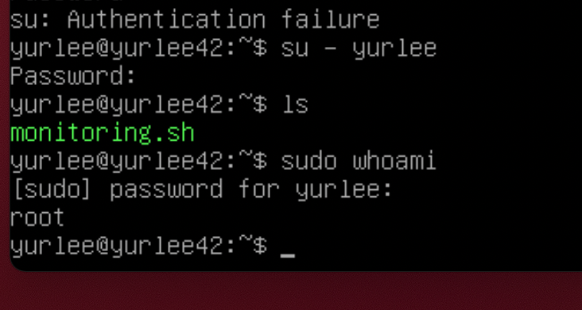
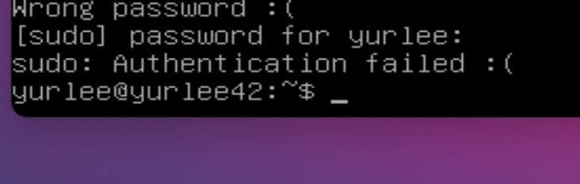
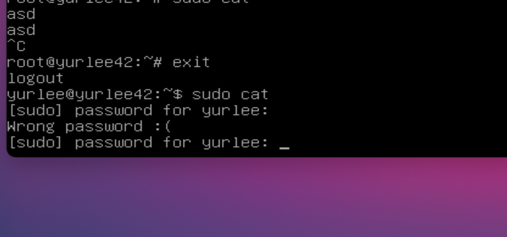
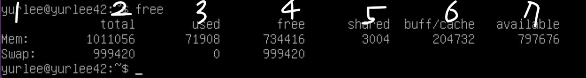
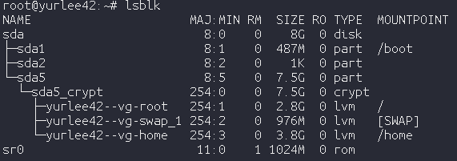

## 과정 하나씩  정리하기

1. 이미지 iso파일 다운하기 ([링크](https://cdimage.debian.org/debian-cd/current/amd64/iso-cd/))
2. managed software center 에서 virtual box 다운
3. new 클릭
4. 경로를 백업할 하드로 선택함 (클러스터에서는 매번 사라지기 때문에)
5. os - linux, debian 설정
6. 메모리 1024 설정
7. '새 가상 하드디스크 만들기' , 'VDI' , '동적 할당', 8기가 선택
8. 상단에 `start` 클릭
9. 1에서 받은 iso파일을 불러와 마운트
10. `Install`
11. 나라 설정
    1. other - asia - 한국 찾아서 선택
12. lvm 설정
    1. 비밀번호 설정
13. 데비안 아카이브 미러 선택 - 한국 - deb.debian.org
14. HTTP proxy 비움
15. configuring popularity-contest - no
16. software selelction - 기본값만
17. [GRUB boot loader](https://m.blog.naver.com/dudwo567890/130158001734) on a hardest - no
    - 부팅가능하게끔 하기위해 부팅용 디스크?를 설정해야함.
    - 여담이지만, 부팅용 디스크를 HDD를 안쓰고 SSD로 쓰면 부팅이 엄청 빠름
18. Enter device manually
19. 과제에서 요구한 곳을 입력 (/boot)
    1. 부팅 완료. `lsblk` 명령어 입력해서 encryped lvm이 2개 이상인지 확인
20. SSH 서비스를 특정 포트에서 실행되게 하자
    - 설치 [How to Enable SSH on Debian 9 or 10](https://phoenixnap.com/kb/how-to-enable-ssh-on-debian)
    - 포트 변경 [howto-change-ssh-port-on-linux-or-unix-server](https://www.cyberciti.biz/faq/howto-change-ssh-port-on-linux-or-unix-server/)
    - 진행하려는데 sudo가 안먹힌다? → [bash: sudo: command not found](https://unix.stackexchange.com/questions/354928/bash-sudo-command-not-found)
    - `sudo systemctl restart ssh`로 재시작하여 설정 적용
21. UFW을 특정 포트로에서만 작동하게
    - 설치 및 실행 [setup-ufw-firewall-on-ubuntu-and-debian](https://www.tecmint.com/setup-ufw-firewall-on-ubuntu-and-debian/)
    - 기본적으로 접근을 막고, 특정 포트만 허용
        - `sudo ufw default deny`
        - `sudo ufw allow {port번호}`
22. hostname이 조건을 만족하는지 확인
    - `cat /proc/sys/kernel/hostname`
23. 새로운 유저를 만들고 해당 유저를 과제에서 필요로 하는 두 그룹에 참가시키자
    1. 유저생성
        - `adduser username`
    2. [debian sudo user  추가](https://m.blog.naver.com/PostView.naver?isHttpsRedirect=true&blogId=jodi999&logNo=221336259983)
        - `usermod -aG sudo {이름}`
            - [man usermod](https://linux.die.net/man/8/usermod)
            - `-aG` 특정 그룹에 유저를 넣는다.
        - `sudo  - {이름}` 으로 새로 만든 사용자로 전환후 `sudo whoami` 로 root 가 뜨는지 확인

            

    3. [리눅스 그룹 생성/삭제/확인/추가 - groupadd](https://webdir.tistory.com/134)
        - `groupadd 그룹명`
    4. 유저 추가 (tom으로 추가했음, `1001(user42)`그룹에 속해있음)
        - `usermod -aG {그룹명} {이름}`
            - cf) usermod에 -G옵션을 붙이면 명시한 그룹에 사용자가 속하게 되고, 현재 사용자가 속해 있는 그룹이 명시되지가 않았다면 해당 그룹에 속하지 않게 된다.
                - (ex. chanlee라는 사용자가 user42와 home이라는 그룹에 속한 상태에서 "usermod -G sudo,user42 chanlee"를 실행하는 경우 sudo와 user42에만 속하게 된다.)
                - 이때 -a옵션(append)을 붙이게 되면 커맨드에 적어준 그룹에 '추가적으로' 들어가게 되는 효과만 발생한다.
        - 그룹 리스트 확인
            - `cat /etc/group`
            - `cat /etc/group | grep user42`
        - 유저 리스트 확인
            - `cat /etc/passwd`
        - 유저가 그룹에 속하는지 확인
            - `id username`
24. 강력한 패스워드 정책을 설정하자
    1. `su -`,   `sudo vi /etc/login.defs`  (기본(default) 비밀번호 항목을 지정하는 파일이다)
        1. `:160` 이동
        2. `PASS_MAX_DAYS 30  PASS_MIN_DAYS 2 PASS_WARN_AGE 7 PASS_MIN_LEN 10` 수정
            - 30일마다 비밀번호가 만료되야함
                - `PASS_MAX_DAYS 30`
            - 비밀번호가 변경되고 최소 2일 후 비밀번호를 변경할 수 있다.
                - `PASS_MIN_DAYS 2`
            - 비밀번호가 만료되기 7일전 유저는 경고메세지를 받을 수 있어야한다.
                - `PASS_WARN_AGE 7`
            - 비밀번호는 10글자 이상, 대문자와 숫자를 포함해야한다. 또한 동일한 문자가 연속3번 이상 존재하면 안된다.
                - `PASS_MIN_LEN 10`
    2. `sudo apt install libpam-pwquality` 패키지 설치 (패스워드 만료 모듈)
    3. `sudo vi /etc/pam.d/common-password`  파일 수정
    4. `:25` 이동
    5. `retry=3 minlen=10 difok=7 ucredit=-1 dcredit=-1 reject_username enforce_for_root maxrepeat=3` 수정
        - 유저의 이름이 포함되면 안된다. (뒤집힌 경우도 검사함)
            - `reject_username`
        - 비밀번호 변경시 적어도 7글자는 이전 비밀번호에 포함되면안된다.
            - `difok=7`
        - 루트 비밀번호도 이 정책을 따라야한다.
            - `enforce_for_root`
        - `ucredit=-1`
            - (대문자 1개이상)  (1이면 최소 1개의 영어 대문자가 비밀번호에 존재해야함을 의미)
        - `dcredit=-1`
            - (숫자 1개 이상)
        - `maxrepeat=3`
            - 중복글자 3개까지 제한
    6. `passwd -e 사용자명`
        1. root계정과 현존하는 사용자 계정의 암호 변경을 강제한다. 다음 번 로그인시에 암호를 변경하라고 뜨게 된다.

25. sudo 정책을 설정하자

    sudo에 대한 강력한 구성을 해야한다.

    - 데비안에서 sudo는 어떻게 관리하는가?
        - `/ect/sudoers`  파일로 관리
            - `visudo` 명령어로 열어야함. 쓰기권한이 없기때문
            - 파일에는 옵션들을 관리하는데  그에 대한 설명은 [man페이지](https://www.sudo.ws/man/1.8.15/sudoers.man.html)에서 확인할 수 있음
        - sudo?
            - 일반 계정에서 Root권한이 필요한 경우, 명령어 앞에  sudo라는 명령어를 붙여 root권한을 가지게 함
            - 그러나 관리자가 해당 일반 계정에 sudo 사용 권한을 주지 않는 경우 사용할 수가 없다
    1. `mkdir /var/log/sudo`
    2. `sudo visudo /etc/sudoers`

        ```
        Defaults	authfail_message="Authentication failed :("
        Defaults	badpass_message="Wrong password :("
        Defaults	log_input
        Defaults	log_output
        Defaults	requiretty
        Defaults	iolog_dir="/var/log/sudo/"
        Defaults	passwd_tries=3
        Defaults	secure_path="/usr/local/sbin:/usr/local/bin:/usr/sbin:/usr/bin:/sbin:/bin:/snap/bin"
        ```

        - 과제 요구사항
            1. 일치하지 않는 비밀번호의 입력은 3회로 제한을 둬야한다.
            2. sudo사용시 에러가 발생하게되면 나오는 메세지를 커스터마이징해라
                - Debian에는 sudo가 없으므로 sudo 패키지를 설치
            3. sudo 를 사용하면서 발생하는 Input/Output들은 모두 기록되어야한다. 위치는 `/var/log/sudo` (해당 폴더를 생성해준다.)
            4. 보안적인 이유로 TTY모드는 활성화되어야한다.
            5. 보안적인 이유로, sudo에서 사용할 수 있는 경로를 제한되어야한다.
                - `/usr/local/sbin:/usr/local/bin:/usr/sbin:/usr/bin:/sbin:/bin:/snap/bin`
        - `authfail_message`
            - 권한 획득 실패 시 출력하는 메세지이다.
            - ctrl+c

                

        - `badpass_message`
            - sudo사용시 에러가 발생하게되면 나오는 메세지를 커스터마이징할 메세지

            

        - `log_input`, `log_output`
            - sudo 명령어 실행시 입력 명령어, 출력 결과를 로그로 저장
        - `requiretty`
            - sudo 명령어 실행시 tty강제
                - ex) 쉘스크립트내부에 `sudo` 넣고 실행불가
        - `iolog_dir`
            - 로그가 저장될 위치지정
            - `/var/log/sudo/00/00` 디렉토리별  설명

                log

                - sudo 실행 시 실행한 위치와 실행한 명령어의 위치가 저장되어 있다.

                stderr

                - sudo로 실행한 명령어가 오류로 인해 실행되지 않았을 시 출력되는 내용이 저장되어 있다.

                stdin

                - sudo로 실행한 명령어가 표준 입력을 받은 내용이 저장되어 있다.

                stdout

                - sudo로 실행한 명령어가 표준 출력으로 결과를 출력한 내용이 저장되어 있다.

                timing

                - session timing file.

                ttyin

                - sudo로 실행한 명령어가 tty로 입력받은 내용이 저장되어 있다.

                ttyout

                - sudo로 실행한 명령어가 tty로 출력한 결과가 저장되어 있다.
        - `passwd_tries`
            - sudo 시도시 비밀번호 재입력 횟수제한
        - `secure_path`
            - sudo 명령어를 통해 실행되는 명령어의 경로를 제한
26. `monitoring.sh`를 작성하자

    ```
    #Architecture: Linux wil 4.19.0-16-amd64 #1 SMP Debian 4.19.181-1 (2021-03-19) x86_64 GNU/Linux
    #CPU physical : 1
    #vCPU : 1
    #Memory Usage: 74/987MB (7.50%)
    #Disk Usage: 1009/2Gb (39%)
    #CPU load: 6.7%
    #Last boot: 2021-04-25 14:45
    #LVM use: yes
    #Connexions TCP : 1 ESTABLISHED
    #User log: 1
    #Network: IP 10.0.2.15 (08:00:27:51:9b:a5)
    #Sudo : 42 cmd
    ```

    - 위 내용들을 출력하는 쉘파일을 작성하고 크론으로 주기적으로 실행시켜야함

        `monitoring.sh`

        ```
        #!/bin/bash
        printf "#Architecture: "
        uname -a

        printf "#CPU physical: "
        nproc --all

        printf "#vCPU :"
        cat /proc/cpuinfo | grep "processor" | wc -l

        printf "#Memory Usage: "
        free -m | grep "Mem" | awk '{printf "%d/%dMB (%.2f%%)", $3, $2, $3 / $2 * 100}'
        printf "\n"

        printf "#Disk Usage: "
        df -P | grep -v ^Filesystem | awk '{sum += $3} {sum2 += $2} END {printf "%d/%dGB (%d%%)", sum/1024, sum2/1024/1024, sum/sum2*100 }'
        printf  "\n"

        printf "#CPU load: "
        top -b -n 1 | grep -Po '[0-9.]+ id' | awk '{print 100 - $1}'

        printf "#Last boot: "
        who -b | sed -E 's/system boot//g' | sed 's/^ *//g'

        printf "#LVM use: "
        if [ "$(cat /etc/fstab | grep '/dev/mapper/' | wc -l)" -gt 0 ];
         then
          echo 'yes'
         else
          echo 'no'
        fi

        connections=$(ss -t | grep -i ESTAB | wc -l)
        printf "#Connexions TCP: $connections ESTABLISHED\n"

        printf "#User log: "
        who | wc -l

        ip=$(hostname -I)
        mac=$(ip addr | grep "ether " |  sed "s/.*ether //g" | sed "s/ brd.*//g")

        printf "#Network: IP $ip ($mac)\n"

        printf "#Sudo: "
        sudo grep "sudo: " /var/log/auth.log | grep "COMMAND=" | wc -l | tr -d '\n'
        ```

        - 현재 OS이름과 커널 버전 ([링크](https://udpark.tistory.com/99))
            - `uname`
        - 물리적으로 설치된 프로세스 갯수 ([링크](https://www.cyberciti.biz/faq/check-how-many-cpus-are-there-in-linux-system/))
            - `nproc --all`
        - 가상으로 설치된 프로세스 갯수 [링크](https://webhostinggeeks.com/howto/how-to-display-the-number-of-processors-vcpu-on-linux-vps/)
            - `cat /proc/cpuinfo | grep processor | wc -l`
        - 사용가능한 램 용량과 이를 %로 표현 ([free 링크](https://www.whatap.io/ko/blog/37/),  [awk 링크](https://recipes4dev.tistory.com/171))
            - `free -m | grep "Mem" | awk '{printf "%d/%dMB (%.2f%%)", ＄3, ＄2, ＄3/＄2 * 100}'`
                - `free`
                    - 메모리 사용량 확인
                    - `-m`
                        - 옵션으로 메가바이트단위로 표현한다. (과제예시에서 그렇게 보여주고있기때문에)
                - `grep "Mem"`
                    - `Mem` 이라는 문자열이 들어간 줄만 필터링
                - `awk`
                    - 파일이나 문자열에서 특정 매칭된 정보를 가져올 수 있다.
                    - printf를  연계해서 사용할 수 있다.
                    - `printf "%d/%dMB (%.2f%%)", ＄3, ＄2, ＄3/＄2 * 100}`
                        - printf 사용법과 동일하다.
                    - `$2, $3` 표현은?
                        - awk에서 매칭된 정보들을 컬럼형식으로 가져올수 있는데, 그때 사용하는 필드

                            

                            

        - 사용가능한 메모리 용량과 이를 %로 표현 ([df 명령어 링크](https://zetawiki.com/wiki/%EB%A6%AC%EB%88%85%EC%8A%A4_%EC%A0%84%EC%B2%B4_%EB%94%94%EC%8A%A4%ED%81%AC_%EC%82%AC%EC%9A%A9%EB%9F%89_%ED%99%95%EC%9D%B8))
            - 남은용량
                - `df -P | grep -v ^Filesystem | awk '{sum += $3} ${sum2 += $2} END { printf "%d/%dGB (%d%%)", sum/1024 ,sum2/1024/1024, sum/sum2}'`
                    - `df -P`
                        - `-P`
                            - 한줄 출력 옵션
                    - `grep -v ^Filesystem`
                        - `-v ^Filesystem`
                            - `Filesystem`으로 시작하는 줄제외
                    - `awk '{sum += $3} ${sum2 += $2} END { printf "%d/%dGB (%d%%)", sum/1024 ,sum2/1024/1024, sum/sum2}`
                        - `{sum += $3} ${sum2 += $2}`
                            - 특정 필드값을 모두 더함
                        - `printf "%d/%dGB (%d%%)", sum/1024 ,sum2/1024/1024, sum/sum2`
                            - `printf`를 활용해 퍼센티지를 표현

        - 프로세서의 사용률 %로 표현 ([top명령어 링크](https://yjshin.tistory.com/entry/Linux-%EB%A6%AC%EB%88%85%EC%8A%A4-CPU-%EC%82%AC%EC%9A%A9%EB%A5%A0-%ED%99%95%EC%9D%B8%ED%95%98%EB%8A%94-%EB%B0%A9%EB%B2%95-TOP-%EB%AA%85%EB%A0%B9%EC%96%B4)1, [링크2](https://www.cubrid.com/tutorial/3794195))
            - `top -b -n 1 | grep -Po '[0-9.]+ id' | awk '{print 100-$1}'`
                - `top -b -n 1`
                    - 1번만 배치모드로 실행 → 실행시킨 그 타이밍의 값을 가져옴
                - `grep -Po '[0-9.]+ id'`
                    - `-P`
                        - 정규표현식으로 필요한 값만 가져옴
                    - `-o`
                        - 빈 줄은 무시
        - 마지막 리부트 시각과 날자 ([링크](https://www.cyberciti.biz/faq/unix-linux-getting-current-date-in-bash-ksh-shell-script/) )
            - `who -b | sed 's/system boot //g' |  sed 's/^ *`
                - `sed 's/^ *//g'`
                    - 앞공백 삭제
        - LVM 사용여부 ([링크](https://askubuntu.com/questions/202613/how-do-i-check-whether-i-am-using-lvm), [조건문 사용법 링크](https://stackoverflow.com/questions/20612891/is-it-possible-to-pipe-multiple-commands-in-an-if-statement))
            - `if [ "$(cat /etc/fstab | grep '/dev/mapper/' | wc -l)" -gt 0];
             then
              echo 'yes';
             else
              echoo 'no';
            fi`
                - `/etc/fstab`
                    - 루트파일 시스템을 볼 수 있으며, lvm파일 시스템은 /dev/mapper로 시작한다.
        - 활성화된 연결의 갯수
            - `ss -t | grep -i ESTAB | wc -l`
            - `ss -t`
                - TCP 연결만 출력
            - `grep -i`
                - case 무시

        - 서버를 사용하는 유저의 수 [링크](https://shaeod.tistory.com/623)
            - `who | wc -l`
        - IPv4주소, MAC 주소
            - `hostname –I`  [링크](https://vitux.com/find-debian-ip-network-address/)
            - `ip addr | grep "ether " | sed "s/.*ether //g" | sed "s/ brd .*//g"`
        - sudo 명령어로 실행된 명령의 수
            - `grep 'sudo:' /var/log/auth.log | grep 'COMMAND=' | wc -l | tr -d '\n'`
            - `/var/log/auth.log` 는 [sudo로 실행된 명령들 관련정보가 기록되는곳](https://unix.stackexchange.com/questions/167935/details-about-sudo-commands-executed-by-all-user)
            - `grep 'COMMAND='` 로 명령어로  기록된 줄만 필터링

        ```bash
        #Architecture: Linux wil 4.19.0-16-amd64 #1 SMP Debian 4.19.181-1 (2021-03-19) x86_64 GNU/Linux
        #CPU physical : 1
        #vCPU : 1
        #Memory Usage: 74/987MB (7.50%)
        #Disk Usage: 1009/2Gb (39%)
        #CPU load: 6.7%
        #Last boot: 2021-04-25 14:45
        #LVM use: yes
        #Connexions TCP : 1 ESTABLISHED
        #User log: 1
        #Network: IP 10.0.2.15 (08:00:27:51:9b:a5)
        #Sudo : 42 cmd
        ```

    1. `monitoring.sh` 를 `wall` 명령어로 실행하여 모든 유저들에게 보여주게 하자
    2. `chmod +x  ./monitoring.sh`  모든 유저에게 실행권한을 주자 (`[chmod +x](https://eunguru.tistory.com/93)`)
    3. cron 으로 10분마다 실행시키자
        1. `sudo crontab -e`
            1. `-e` visual편집기 모드
        2. `*/10 * * * * /home/yurlee/monitoring.sh | wall`  → 주기 설정 `초 분 시 일 월 주 년`
            1. [N분마다 크론 주기 설정하는법](https://zetawiki.com/wiki/%ED%81%AC%EB%A1%A0%ED%83%AD_%EC%9E%91%EC%97%85_5%EB%B6%84%EB%A7%88%EB%8B%A4_%EC%88%98%ED%96%89)
        3. 파일을 수정하지않고 중지시키기
            1. `sudo crontabl -r`
            2. `service crond stop`
        4. 현재 크론 확인
            1. `sudo crontabl -l`

## 평가지 번역 (발번역)

[링크](https://github.com/wshloic/born2beroot_correction/blob/master/correction_born2beroot.pdf)

### 사전 확인

- 디펜스는 학생 또는 그룹들이 모두 지식을 공유했다는 가정하에 진행되어야함
- 만약 과제가 제대로 제출되지 않았다면 0점이며 그 상태에서 바로 평가를 종료
- 당신은 이 프로젝트의 경우 깃 레포지토리를 클론해야합니다.

## General instruction

### **Project overview**

- 디펜스하는 동안 피평가자는 평가자를 다양한 관점에서 도와줘야함
- `signature.txt` 파일은 레포지토리 root에 있어야함
- `.vdi`파일로 인해 만들어진  `signature.txt` 파일 내부의 시그니쳐를 확인해라. `diff` 명령어를 사용해 평가자가 다운받은 파일과 비교해도됨. 필요시 `.vdi`파일의 위치를 물어봐도됨
- 평가를 받기 위해 가상 머신을 실행해라
- 만약 무언가가 제대로 동작하지 않거나 두 시그니쳐가 다른 경우 여기서 평가를 중단해라

### **Simple setup**

- 기억해라: 무언가 확인해야할때, 피평가자는 평가자를 도와주어야한다.
- 가상머신은 graphical 환경으로 시작되면 안된다.
- 가상머신에 연결되기전에 비밀번호가 요구되어야한다.
- 최종적으로, 로그인되어 연결되어야하며 접속된 유저계정은 루트가 아니여야한다.
- 비밀번호 선택에 주의, 다음 규칙을 따라야한다.
    - 피평가자의 도움을 받아 UFW 서비스가 적용되었는지 확인
    - 피평가자의 도움을 받아 SSH 서비스가 적용되었는지 확인
    - 피평가자의 도움을 받아 운영체제가 데비안인지 CentOS인지 확인
- 만약 무언가가 제대로 동작하지 않으면 여기서 평가를 중단해라

### **User**

- 현재 가상 머신에 있는 피평가자의 유저 계정으로 진행되어야한다?. `sudo`, `user42`  그룹에 있는지 확인해라 (`id 계정명`)
- 다음 절차들로 비밀번호 정책이 과제에서 주어진 주제들로 잘 적용되었는지 확인해라? (`adduser test1`)
    - 첫번째, 유저를 생성하고 니가 원하는 비밀번호를 지정해라. 과제의 규칙에 따라. 가상머신에 어떻게 규칙을 지정할 수 있었는지? 피평가자는 설명해야한다
        - `adduser test1`
        - `sudo vi /etc/login.defs` 에서 비밀번호에 대한 유효기간 관련 설정
        - `libpam-pwquality`패키지설치 후  `vi /etc/pam.d/common-password` 파일에서 비밀번호 규칙설정
    - 보통 한두개 파일을 수정함. 문제가 있으면 여기서 평가 중단
    - 이제 새로운 유저 계정이 생겼다. 피평가자에게 `evaluating` 이라는 그룹을 만들어 이 유저를 그룹에 포함시키게 해라. 마지막으로  그 유저가 `evaluating` 그룹에 포함되어있는지 확인해라
        - `groupadd evaluating`
    - 마지막으로, 피평가자는  이 비밀번호 정책의 장점과 단점을 설명해야한다.
- 만약 무언가가 제대로 동작하지 않거나 설명이 깔끔하지 않으면 평가를 중단해라

### Hostname and partitions

- 다음 규칙을 따라서 호스트이름을 지정햇는지 확인해라
    - login42
- 평가자의 아이디로 호스트이름을 변경하고, 재부팅해라. 변경이 안돼있으면 여기서 평가중단
    - 확인
        - `hostnamectl`
    - 변경
        - `sudo hostnamectl set-hostname [hostname]`
- 이제 원래 호스트이름으로 복구할 수 있다
- 피평가자에게 어떻게 이 가상머신의 파티션들을 볼 수 있는지 물어봐라
    - `lsblk`

        

- 과제에서 주어진 예제와 비교해라. 주의: 만약  피평가자가 보너스를 진행하는 경우 보너스의 예제를 무조건 참고해야함
- 이 파트는 점수를 위해 토론할 기회다? 피평가자는 LVM이 뭔지 어떻게 작동하는지 만족할만한 설명을해야한다. 아니면 평가 중단해라

### SUDO

- 가상머신에 `sudo` 프로그램이 설치되었는지 확인해라
- 피평가자는 아까 만든 새로운 유저계정이 `sudo`그룹에 있는걸 보여줘야한다
    - `id 계정이름`
- 과제는 강력한 규칙을 `sudo`에 요구한다. 피평가자는 `sudo` 를 쓰는 이유를 설명해야한다.?
- 두번째로, 과제에서 요구한 규칙을 구현한 것을 보여줘야한다
    - `/var/log/sudo` 폴더에 하나의 파일이라도 존재하는지. 이 폴더에 있는 콘텐츠들을 확인해라, 당신은 `sudo`와 함께 사용된 명령어들을 확인할 수 있어야한다.
    - 마지막으로 `sudo`를 붙여 아무거나 실행하고, 해당 폴더가 업데이트 됐는지 확인해라
- 만약 무언가가 제대로 동작하지 않거나 설명이 깔끔하지 않으면 평가를 중단해라

### UFW

- 가상머신에 UFW프로그램이 설치됐는지 확인해라
- 제대로 작동하는지 확인해라
    - `sudo ufw status verbose`
- 피평가자는 UFW이 뭔지 이것이 가지는 가치? 이유?를 설명해야한다.
- 실행되고 있는 UFW규칙을 리스팅해라. 이 규칙은 4242 포트에 적용되어있어야한다.
    - `sudo ufw status numbered`
- 새로운 규칙을 8080에 추가해라. 이 포트가 기존 규칙에 추가되었는지 확인해라?
    - `sudo ufw allow 8080`
    - `sudo cat /etc/ufw/user.rules`
- 마지막으로 피평가자의 도움으로 새로운 규칙을 지워라.
    - `sudo ufw delete 규칙번호`
- 만약 무언가가 제대로 동작하지 않거나 설명이 깔끔하지 않으면 평가를 중단해라

### SSH

- 가상머신에 SSH 서비스가 잘 설치되었는지 확인해라
- 제대로 작동하는지 확인해라
- 피평가자는 이것이 가지는 가치? 이유?를 설명해야한다.
- SSH서비스가 4242포트에서만 적용되는지 확인해라
    - `vi /etc/ssh/sshd_config`
- 피평가자는 SSH를 통해 당신을 도울수 있어야한다. 새로운 유저를 만들어 로그인하는것을
    - `ssh <username>@<ip-address> -p 4242`
- 이걸 하기 위해 당신은 키나 간단한 비밀번호를 사용할 수 있다. 이 것은 피평가자에 달렸다. 물론 당신은 root유저에 SSH를 사용할 수 없다.
- 만약 무언가가 제대로 동작하지 않거나 설명이 깔끔하지 않으면 평가를 중단해라

### Script monitoring

- 피평가자는 아래 내용들을 간단하게 설명할 수 있어야한다.
    - 보여지는 내용을 위해 작성된 코드들?
    - cron이 뭔지
    - 어떻게 이 스크립트를 부팅이 되고 난 후 10분마다 실행시킬수있었는지
    - 스크립트가 제대로 작동된다면, 피평가자는 이것을 30초마다 실행시켜야한다. 당신은 아무값이나 넣어 실행시켜볼 수 있다, 그리고 피평가자는 머신이 켜졌을때 파일 수정없이 스크립트를 중단시켜야한다. 머신이 시작할때, 스크립트가 그 위치에 계속 있는지, 바뀌지 않았는지, 수정되지 않았느지 확인해야한다.
        - 멈추기
            - `/etc/init.d/cron stop`
        - 시작
            - `/etc/init.d/cron start`
        - reboot시 cron자동실행 중단
            - `sudo systemctl disable cron`
        - 크론은 30초마다 실행시키는 옵션이 없으므로 꼼수를 부려야함
            - `sudo crontab -e`
            - `* * * * * sleep 30; /home/yurlee/monitoring.sh;`
    - 만약 무언가가 제대로 동작하지 않거나 설명이 깔끔하지 않으면 평가를 중단해라
