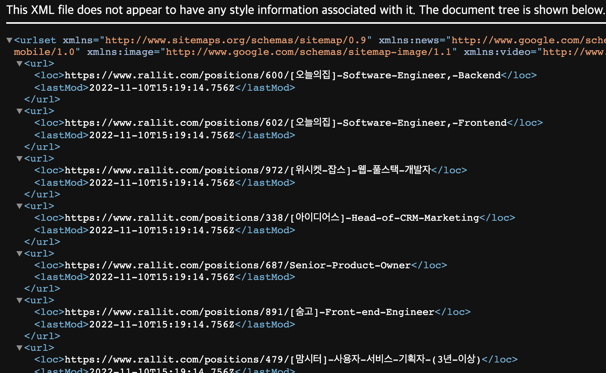
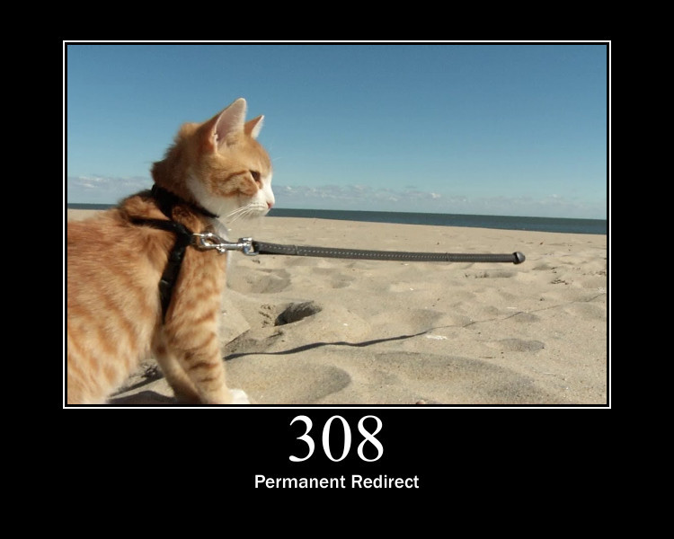

## 목표
- 기존에 next router들에 대한 정보만 존재하던 간단한 sitemap에 상세페이지들에 대한 정보를 추가한다.
- SEO가 개선되어야할 페이지로 접근시 url에 서치키워드를 추가하여 리다이렉션 한다.


## 문제 해결과정

### 레퍼런스 찾기
일반적인 url 접근시 서치키워드를 붙여주는 ux는 stackoverflow의 질문답변 페이지에서 확인할 수 있습니다.

https://stackoverflow.com/questions/31079081 접근시

https://stackoverflow.com/questions/31079081/programmatically-navigate-using-react-router 로 url이 변경됩니다.

뒤에 붙은 `programmatically-navigate-using-react-router`은 질문 타이틀에 있는 공백과 특수문자를 `-`로 치환시킨것과 동일합니다.


### sitemap 업데이트 하기

stackoverflow처럼 URL을 변경해주는 부분을 프론트엔드 코드에서 로직을 추가한다고 해서 SEO에 영향은 없기 때문에 몇가지 작업이 필요합니다. 그중 하나는 sitemap에 대한 업데이트입니다.

sitemap은  `./robots.txt` 에 명시되어 크롤러에게 사이트의 구조를 알려주는데 사용됩니다

next.js는 `pages`폴더 하위에 만들어진 파일들을 기반으로 `publiic` 폴더에 sitemap을 생성해줍니다.

[next-sitemap](https://github.com/iamvishnusankar/next-sitemap)은 SEO에 필요한 `sitemap.xml`, `robots.txt` 파일들을 관리하는걸 도와줍니다.

#### 설치
```
yarn add next-sitemap
```


#### 사용방법

1. root에 `next-sitemap.config.js` 생성
```javascript
/** @type {import('next-sitemap').IConfig} */
module.exports = {
  siteUrl: process.env.SITE_URL || 'https://example.com',
  generateRobotsTxt: true,
}
```

2. package.json - script 추가
```json
"build": "next build && yarn postbuild",
"postbuild": "next-sitemap"
```

3. 이제부터 `yarn build` 실행시 `next-sitemap`을 통해 sitemap이 생성됩니다.

#### dynamic sitemap
SEO를 개선할 페이지의 URL이 정적이지 않은 경우, 동적인 sitemap을 제공해야합니다.

동적인 sitemap을 제공하기 위한 라우터를 추가하기 위해 `pages` 디렉토리에 `server-sitemap.xml/index.tsx` 파일을 생성해주세요.


```tsx


export const getServerSideProps: GetServerSideProps = async (ctx) => {
	// 데이터를 호출합니다.
	const fields = response.map(({ id, title }) => ({ id, title })).map(
		({ id, title }) => {
				return {
					loc: `https://example.com/detail/${id}/${title}`, // seo의 대상이되는 url
					lastMod: new Date().toISOString(),
				};
			});

			return getServerSideSitemap(ctx, fields);
		}
	);
};

const SitemapXML = () => {
	return null;
};


export default SitemapXML;
```


이제 `/server-sitemap.xml`에 접근하면 다음과 같이 사이트맵이 생성된걸 확인할 수 있습니다.




그리고 동적으로 생성된 sitemap이 있기때문에 이 부분을 `next.config.js` 설정에 명시해야합니다.


```javascript

/** @type {import('next-sitemap').IConfig} */
module.exports = {
  ...
  exclude: ['/server-sitemap.xml'], // 정적인 사이트맵 리스트에서 제외
  robotsTxtOptions: {
    policies: [
      {
        userAgent: "*",
        disallow: [''], // 크롤링하면 안되는 페이지 pathname을 나열합니다.
      }
    ],
    additionalSitemaps: [
      `https://example.com/server-sitemap.xml`, // 동적으로 생성되는 사이트맵 포함
    ],
    transformRobotsTxt: async (_, robotsTxt) => `${robotsTxt}\n\n${customOptions}`, // robots.txt를 커스터마이징할 때 사용함
  },
}

```


### Next.js 리다이렉션 추가
사이트맵은 유저나 크롤러가 접근했을 때 브라우저에서 URL을 바꾸는 역할을 하진 못합니다.
리다이렉션 동작을 코드상에 추가해줘야합니다.

Next.js를 사용하는 경우, 리다이렉션은 서버 요청을 제어할 수 있는 `getServersideProps` 에서 가능합니다.

```typescript

const needRedirect = URL이_유효하지_않은가?

if (needRedirect) {
	return {
		redirect: {
		destination: SEO를_위한_pathname,
		permanent: true, // 308 redirect
	};
}
```


이제 SEO를 위한 suffix가 적용되지 않은 URL로 접근시, destination으로 지정한 URL로 리다이렉션됩니다. 크롬 개발자도구를 열어 network탭을 확인하면, 아래처럼 status code가 바뀌어 있는걸 확인하실 수 있습니다.


#### 상태코드로 308을 쓰는 이유




stackoverflow의 질문답변 페이지에서는 리다이렉션시 301 상태코드를 사용중입니다. 하지만 Next.js 공식사이트에서는 리다이렉션시 301(Moved Permanently) 대신[ 307(Temporary Redirect), 308(Permanent Redirect) 상태코드를 사용할 것을 권장](https://nextjs.org/docs/api-reference/next.config.js/redirects)하고 있습니다.

그 이유는 동작방식의 차이에 있습니다. 301 상태코드로 리다이렉트를 하는 경우, Request의 Method와 상관없이 GET 요청으로 변경합니다. 리다이렉션되는 요청이 GET Method가 아닌 경우 유저가 의도하지 않은 Method로 변경될 수 있고, 유저가 보낸 payload가 유실될 수 있기때문에 Next.js에서는 301 리다이렉션을 권장하지 않습니다.


## 아쉬운 점
현재 구조로는 `server-sitemap.xml` 을 조회할 때마다 서버에서 api를 호출하는 구조입니다. 현재는 서비스에서 사용되는 데이터의 양이 적어 문제가 되지않지만, 데이터가 많아지게되면 불필요한 조회들와 연산들이 많아져 문제가 생길수 있을것 같습니다. 캐싱을 추가하고 요청이 생길 때만 해당 캐시를 무효화하는 방식이 필요해보입니다.


## 참고링크
- https://medium.com/volla-live/next-js%EB%A5%BC-%EC%9C%84%ED%95%9C-sitemap-generator-%EB%A7%8C%EB%93%A4%EA%B8%B0-10fc917d307e
- https://www.zodaland.com/tech/16
- https://www.sitemaps.org/ko/protocol.html
- https://moonsupport.oopy.io/post/11
- https://stackoverflow.com/questions/2594179/multiple-sitemap-entries-in-robots-txt
- https://nextjs.org/docs/api-reference/next.config.js/redirects
- https://velog.io/@himprover/Nextjs-Redirect-%EC%98%B5%EC%85%98%EC%97%90-Permanent%EB%8A%94-%EB%AD%90%EC%A7%80#301-302%EC%99%80-307-308%EC%9D%98-%EC%B0%A8%EC%9D%B4
- https://nextjs.org/docs/routing/dynamic-routes#optional-catch-all-routes
- https://www.infidigit.com/news/308-redirects-for-seo-are-they-better-than-301/
